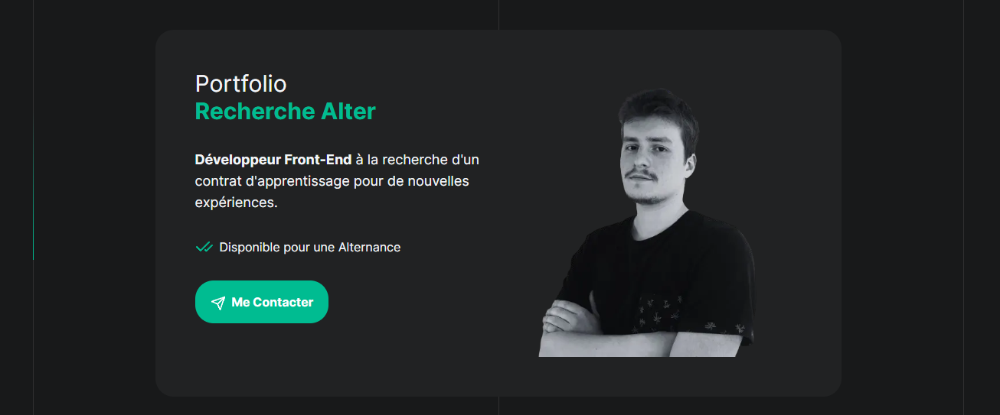

# Portfolio Maxime Turquet

## Projet de Développeur Front-End

## Contexte

Salut ! moi c'est Maxime Turquet je suis pour l'instant développeur front-end et voici mon portfolio qui met en avant mes compétences et mes projets réalisés. 

Ce site a été développé dans le but de démontrer mes capacités techniques, mes connaissances des outils modernes et mon aptitude à apprendre de nouveaux langages rapidement.

lien : https://maxime-turquet.vercel.app/

## Objectif

Créer un portfolio professionnel en utilisant des technologies modernes et non enseignées dans la formation suivie, à savoir Next.js, TypeScript et Tailwind CSS. Le but est de prouver la capacité d'apprentissage et d'adaptation à de nouveaux outils et frameworks.

## Cahier des charges

- **Présentation du profil** : Inclure les formations suivies et les compétences acquises.
- **Présentation de projets** : Afficher au moins 2 projets avec des descriptions détaillées, les défis rencontrés, les solutions apportées, les compétences développées et des liens vers le code source.
- **Hébergement** : Utiliser une plateforme comme Vercel pour déployer le site.
- **Responsivité** : Assurer une bonne expérience utilisateur sur mobile et tablette.
- **Interdictions** : Ne pas utiliser de CMS ou de site builder no-code (à l'exception de WordPress avec du code personnalisé).

## Description du site

### Architecture et Technologies Utilisées

Le site est construit avec Next.js pour la génération de pages statiques et dynamiques, TypeScript pour un typage sécurisé et robuste, et Tailwind CSS pour une gestion rapide et efficace du design et du style.

## Technos

  

Utilisation de `Next.js` pour la structure du site. 
Utilisation de `TypeScript` pour le typage statique. 
Utilisation de `Tailwind CSS` pour le style et la mise en page. 
Utilisation de `GitHub` pour le versionning et `Vercel` pour le déploiement. 

### Hébergement sur Vercel

Vercel est une plateforme d'hébergement spécialisée pour les sites web statiques et les applications front-end. Optimisée pour des frameworks modernes comme Next.js, elle offre une expérience de déploiement simplifiée. Le site de Maxime est hébergé sur Vercel, permettant des déploiements rapides directement depuis le dépôt GitHub.

Pour mettre en ligne le site :
1. Créer un compte Vercel.
2. Se connecter à son compte GitHub.
3. Sélectionner le projet à déployer.

## Installation

### Prérequis

Assurez-vous d'avoir [Node.js](https://nodejs.org/) et [npm](https://www.npmjs.com/) installés sur votre machine.

### Démarrer le Projet Next.js

Ce projet a été initialisé avec [Next.js](https://nextjs.org/), offrant une structure de base prête à l'emploi pour démarrer rapidement le développement.

### Scripts Disponibles

Dans le répertoire du projet, vous pouvez exécuter les commandes suivantes :

#### `npm run dev`

Lance l'application en mode développement.\
Ouvrez [http://localhost:3000](http://localhost:3000) pour voir l'application dans votre navigateur.

La page se rechargera automatiquement lors de modifications.\
Vous pouvez également voir les éventuelles erreurs dans la console.

#### `npm run build`

Construit l'application pour la production dans le dossier `build`.\
Il compile correctement Next.js en mode production et optimise la construction pour de meilleures performances.

#### `npm start`

Démarre le serveur en mode production après avoir construit l'application.\
Ouvrez [http://localhost:3000](http://localhost:3000) pour voir l'application dans votre navigateur.

### Conclusion

En suivant ce guide, vous pourrez configurer et lancer rapidement le portfolio de Maxime Turquet. L'utilisation des technologies modernes et des meilleures pratiques de développement garantit le succès de ce projet ambitieux. Bonne programmation !
